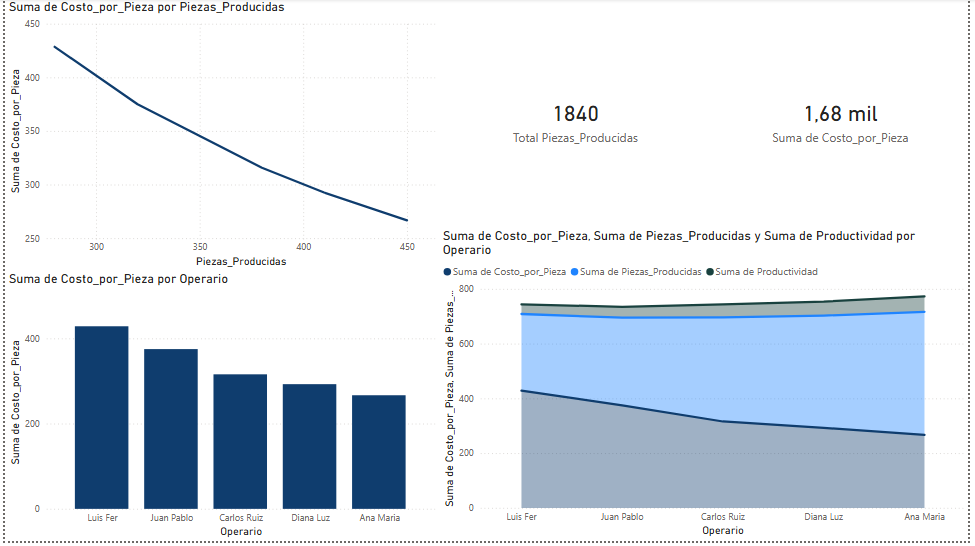

# ⚙️ Optimización de Productividad y Análisis de Costo Unitario

## 📌 Contexto del Proyecto
Este proyecto se enfoca en el análisis de desempeño de un equipo de 5 operarios durante una jornada laboral de 8 horas. El objetivo principal fue identificar desviaciones en la productividad horaria y el impacto directo que tiene el bajo rendimiento en el costo unitario de fabricación de cada pieza.

## 🛠️ Herramientas Utilizadas
* **Lenguaje:** Python (Pandas).
* **Metodología:** Gestión de operaciones, toma de tiempos y costeo estándar.
* **Visualización:** Power BI para el monitoreo de KPIs de planta.

## 📊 Hallazgos y Resultados (KPIs)
A partir del procesamiento de datos, se generaron los siguientes indicadores clave:

* **Volumen Total:** Se procesaron **1.840 piezas** en la jornada analizada.
* **Benchmark de Eficiencia:** **Ana Maria** se identificó como la operaria más eficiente, con una productividad de **56.25 piezas/hora** y el costo por pieza más bajo (**$266.67**).
* **Punto de Ineficiencia:** **Luis Fer** presentó el desempeño más bajo con **35 piezas/hora**, lo que elevó el costo unitario a **$428.57** (un **60% más costoso** que el estándar de Ana Maria).
* **Cumplimiento de Meta:** Solo el **40% del equipo** alcanzó el objetivo técnico de 50 piezas por hora.

## 🚀 Propuesta de Mejora (Ingeniería Industrial)
Basado en los datos visualizados en el dashboard, propuse las siguientes acciones:
1. **Plan de Reentrenamiento:** Implementar sesiones de "shadowing" con Ana Maria para estandarizar procesos.
2. **Revisión de Métodos:** Analizar las causas raíz del bajo desempeño en los operarios con mayor costo unitario.
3. **Optimización de Costos:** Al estandarizar la productividad al nivel de los operarios más eficientes, la empresa podría reducir significativamente el costo operativo total.

## 📊 Visualización y Entregables

### 🖥️ Dashboard Interactivo
Para facilitar la revisión de los hallazgos, se adjunta una vista previa del dashboard desarrollado:

### 📂 Archivos del Proyecto
* [📥 Descargar Reporte en PDF](Analisis_Productividad.pdf)
* [📊 Archivo Fuente de Power BI (.pbix)](Analisis_Productividad.pbix)
* [🐍 Script de Procesamiento en Python](Analisis_de_Productividad_Costos.ipynb)

