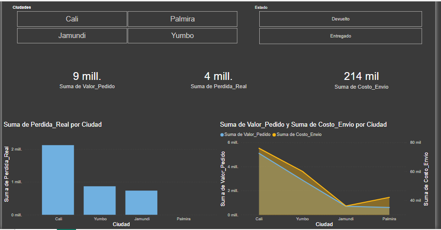

# 🚚 Auditoría de Devoluciones y Pérdida Operativa

Este proyecto simula una auditoría logística para la empresa "Valle-Tech", enfocada en cuantificar el impacto financiero de los pedidos devueltos y la eficiencia de los costos de envío por zona geográfica.

## 🛠️ Desafío Técnico: Data Wrangling Avanzado
Se implementó un pipeline de limpieza para corregir errores de origen:
* **Estandarización de Texto:** Uso de métodos de strings para unificar nombres de ciudades (Cali vs CALI) y eliminación de espacios redundantes.
* **Limpieza Financiera Compleja:** Eliminación de símbolos de moneda ($) y puntos de mil para permitir cálculos aritméticos.
* **Imputación Estadística:** Gestión de valores `NaN` en costos de envío mediante la media poblacional.

## 🔍 Hallazgos Estratégicos (Insights)
* **Concentración de Pérdida:** Se identificó una pérdida total de **$3.725.000**, de la cual **Cali representa el 57%**, convirtiéndose en la zona de mayor riesgo operativo.
* **Eficiencia en Palmira:** La ciudad de Palmira registró **0% de pérdida por devoluciones**, sirviendo como modelo de éxito para las otras rutas.
* **Análisis de Costos:** Cali presenta los costos de envío más altos ($76.000), sugiriendo una necesidad de renegociación de tarifas o reoptimización de rutas de última milla.

## 🛠️ Herramientas Utilizadas
* **Python:** Pandas para la lógica condicional de `Perdida_Real`.
* **Visualización:** Power BI / Looker Studio para el Dashboard de impacto regional.

## 📊 Visualización y Entregables

### 🖥️ Dashboard Interactivo
Para facilitar la revisión de los hallazgos, se adjunta una vista previa del dashboard desarrollado:

### 📂 Archivos del Proyecto
* [📥 Descargar Reporte en PDF](Devoluciones.pdf)
* [📊 Archivo Fuente de Power BI (.pbix)](Devoluciones.pbix)
* [🐍 Script de Procesamiento en Python](Valle-Tech.ipynb)
