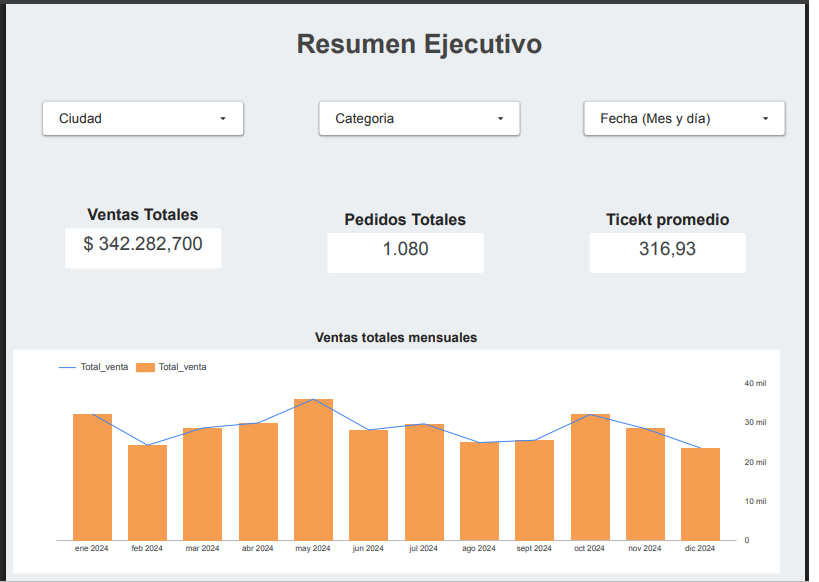
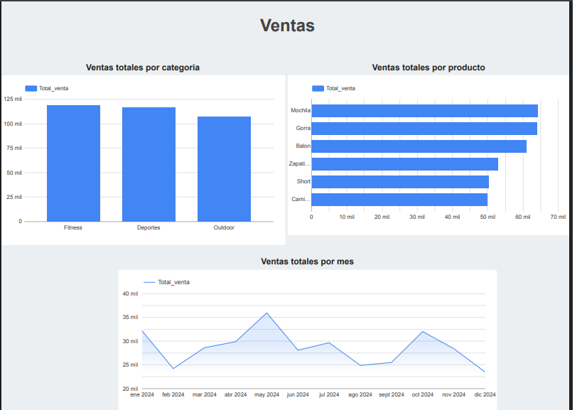
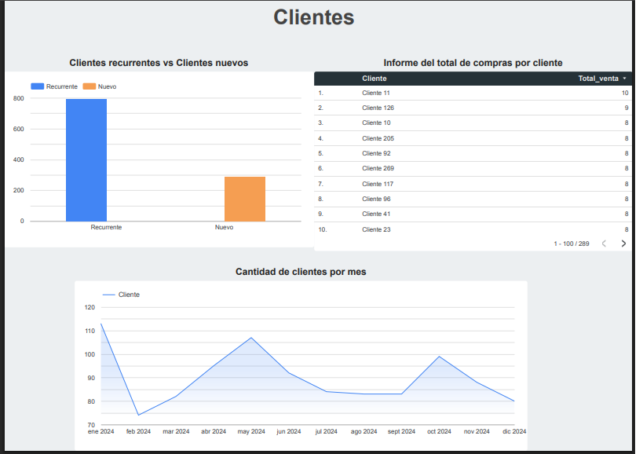

# 📊 E-commerce Sales & Customer Analysis Dashboard
---

## 📌 Project Overview

This project analyzes sales and customer behavior for an e-commerce business. The objective was to transform raw transactional data into actionable business insights using Excel and Looker Studio.

---

## 🛠 Tools Used

Microsoft Excel

Google Sheets

Looker Studio

Data Cleaning & Transformation

Customer Segmentation (New vs Returning)

---

## 📈 Key Business Insights

May was the highest revenue month, suggesting seasonal opportunity.

December showed the lowest performance, indicating improvement potential.

Top 3 best-selling products: Backpack, Cap, Ball.

Majority of customers were returning customers.

Significant drop in customers during February.

---

## 📊 KPIs Included

Total Revenue

Total Orders

Average Order Value (Ticket Promedio)

Monthly Growth

Customer Segmentation

Purchase Frequency

Top Products

---

## 🎯 Business Recommendations

Replicate May marketing strategies in low-performance months.

Strengthen acquisition campaigns to increase new customers.

Boost December sales with promotional strategies.

Implement retention campaigns to reduce customer drop-off.

---

## 📈 Dashboard

🔗 Ver dashboard interactivo:
[Ver dashboard](https://lookerstudio.google.com/reporting/85b5611a-3b38-4394-a29d-b7beb1d8c209)

📷 Vista previa:

