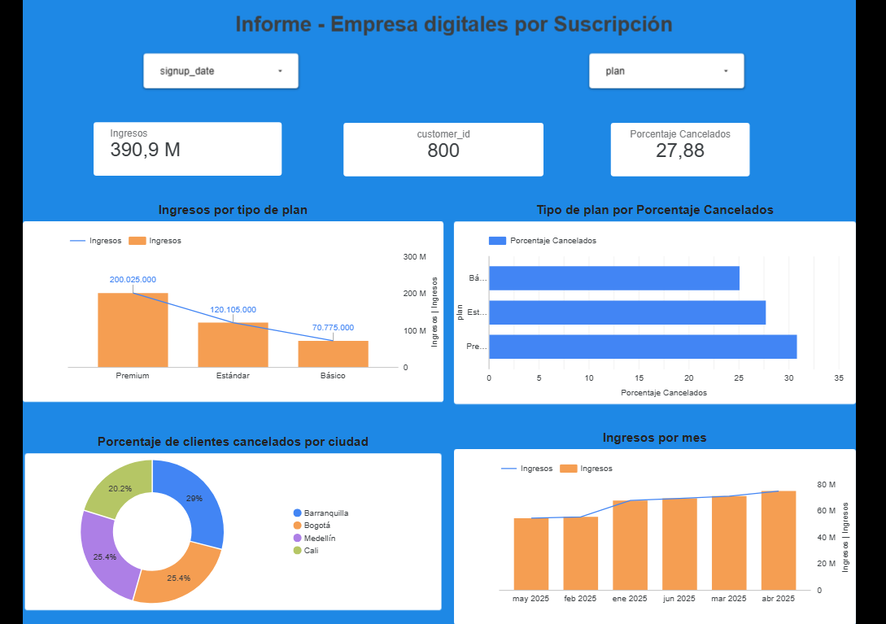

📊 Análisis de Churn e Ingresos – Empresa de Suscripciones

📌 Contexto del negocio

Una empresa digital basada en modelo de suscripción desea analizar:

-La tasa de cancelación (Churn Rate)

-Los ingresos generados por tipo de plan

-El comportamiento mensual de ingresos

-Las ciudades con mayor riesgo de cancelación

-El objetivo es identificar oportunidades para reducir churn y optimizar ingresos.

🛠️ Herramientas utilizadas

-Google BigQuery (SQL) → Modelado y análisis de datos

-Looker Studio → Visualización y dashboard interactivo

-Generación de datos simulados para análisis exploratorio

📂 Estructura de los datos

-Tabla principal: subscriptions

Variables principales:

-customer_id

-city

-plan

-signup_date

-monthly_fee

-tenure_months

-is_active

## 📊 Dashboard Interactivo

🔗 Ver dashboard en línea:
[Ver Dashboard](https://lookerstudio.google.com/reporting/444d1e1d-80ef-4eca-a7a8-259bdfbbd2cc)

📷 Vista previa:

